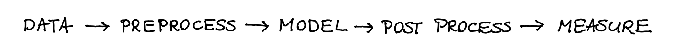

# Scikit-Fairness

The goal of this project is to attempt to consolidate fairness
related metrics, transformers and models into a package that (hopefully)
will become a contribution project to scikit-learn.

Consider all the steps in a machine learning pipeline.

This package will offer tools at every step to make the pipeline more fair.

Fairness, in data science, is a complex unsolved problem for which many
tactics are proposed - each with their own advantage and disadvantages.
This packages aims to make these tactics readily available,
therefore enabling users to try and evaluate different fairness techniques.
